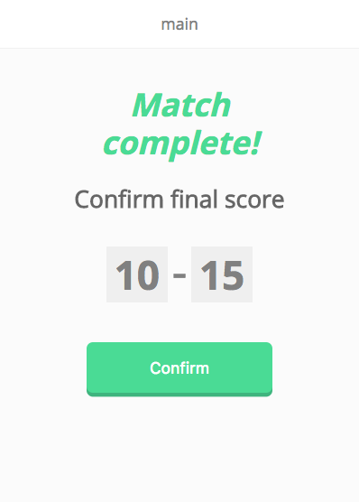

<h1 align="center">
  
  <br>
  <br>
  Windmill score app
</h1>
<br>

## Live version
<a href="http://minor-frisbee.herokuapp.com/">Live demo here</a>

## Concept
One of the most remarkable things about Ultimate Frisbee is that there is no referee on the field to blow a whistle when something goes wrongs. In Ultimate Frisbee, anyone can decide whether it was a goal or not. In this app I want to enhance this honorable task by giving the users the option to vote for goals. The users can all decide if a point should be increased or stay the same whether on what they think is right, the majority vote wins and settles the score.

## Core functionality
-  [x] oauth2 login with the Leaguevine API
-  [x] a page that displays the matches in the tournament
-  [x] the ability to go to that match in order to participate in the score event
-  [x] a 15 second time-based event where users can vote real-time to increase/halt the score of both teams
-  [x] socket rooms with their own unique time-based events
-  [x] voting interface is only enabled during the time-based event
-  [x] an option to adjust the score
-  [x] an option to send the score to the Leaguevine API
-  [ ] user needs to be notified when entering a room when there's an ongoing time event
-  [ ] time event button shouldn't be accessible during the time even

## Core flow


## Extra features
-  [x] real-time percentage of votes in the time-based events
-  [x] cool animations
-  [x] a progress bar for the time event
-  [ ] display all tournament matches (pools/brackets/finals etc)
-  [ ] different roles for players/organizers
-  [ ] stats on the teams that are competing during the voting event

## TODO
-  [x] saving the voting events/game rooms in a database
-  [ ] synchronise the voting system or let incoming users wait
-  [x] enable the interface during the time-based event, disable it otherwise
-  [x] users should only be able to vote once during a time-based event
-  [x] feedback about the voting process
-  [ ] loading indicator
-  [ ] styling
-  [ ] UX
-  [ ] feature detection where a user that cannot vote won't see the voting interface
-  [ ] feature detection for sockets
-  [ ] see if a client is still online by polling every second
-  [ ] request doesn't work sometimes, probably the API but should look into it
-  [ ] save poolData somewhere for if users come back to a room

## Coding process
### Week 1
The first week I started out by getting to know the Leaguevine API. I set up the OAuth 2.0 protocol so that users can log in with Leaguevine in order to get the correct data/rights for the app. The most important thing I had to check was to see if I could make a POST to the API with an adjustable score. The way I did this that was to move the adjustable score into another "final score" form where the user could still adjust it if the event/scoring would have gone wrong. After I fixed that I knew I could start making the app.

-  [x] researched the API
-  [x] OAuth 2.0 protocol
-  [x] simple increment/decrement interface where users could raise/lower the score of each team
-  [x] a final score form where the changed numbers are put in as values, can still be changed by the user
-  [x] POST the final score to the API
-  [x] made a client side time-based event prototype
-  [x] voting percentage changes depending on how many upvotes/downvotes there are
-  [x] score gets updated if the voting percentages is higher than 50%

### Week 2
This week it was important that the time-based events could be done in real-time. The biggest challenge was getting multiple rooms to show unique events, next to socket rooms I had to add a database so that users would see the same data when they just entered an ongoing socket event. I tried out Lockr, a server side version of localStorage but it didn't live up to my standards because I would lose all data when the client/Javascript would not work for some reason. I decided to stick to MongoDB and carry on. 

To my suprise I managed to get a lot of the technical difficulties working which gives me a lot of confidence to finish the app properly. The next big challenge is being able to exact synchronised data when joining an ongoing event, the best solution here might be to let the user know that he has to wait for the event to be over.

-  [x] got all pool matches to display on the main page
-  [x] each pool match has its unique page/data using socket rooms
-  [x] added MongoDB for the voting events in each room
-  [x] made the voting event timer server side instead of client side
-  [x] all voting data gets saved real-time so a user can join a room while a voting event is being played and still participate (there are still some sync issues)

### Week 3
This week I tested my app on the Windmill tournament. Long story short there were a couple of tiny bugs to fix and I found out that 30 seconds was way too long for the time event. I also found out that I needed to use a progress bar instead of a countdown because the client doesn't always sync well.

This week I made some good progress on the core functionality. The voting interface is only enabled during time events and every user has 1 vote per event. I also started with CSS and made some cool animations.

Only a few things left to do. I have to make a 'wait for voting' screen for when the user comes into a room where the time event is already ticking. Besides that I also have to make sure that the event button can only be used once during an event.

-  [x] fixed a bug where the percentage was reset on different clients
-  [x] voting interface is only enabled during an event
-  [x] 1 vote per event per user
-  [x] made a progress bar instead of a countdown for the time event
-  [x] styling for the score page
-  [x] sweet animations for score updates/events

## Build
To run the application:
```bash
git clone
```

In order to get this app working you need to fill in the following <a href="https://www.npmjs.com/package/dotenv">dotenv</a> variables:  

```bash
CLIENT_ID={your client id here}
```  
```bash
CLIENT_SECRET={your client secret here}
```  
```bash
REDIRECT_URI={your redirect uri here}
```  

You can receive theses variables by making a new "Sandbox" on the Leaguevine development site:  
<a href="http://www.playwithlv.com/docs/api/">http://www.playwithlv.com/docs/api/</a>  
  
Now you only have to make sure to pass in your <a href="https://www.mongodb.com/">MongoDB</a> database. Simply place your database link inside the mongoose.connect braces:

```javascript
mongoose.connect({your link here})
```  

Finally, to use the app you need to run the following commands:  
```bash
npm install
```
To install the Node dependencies.

```bash
npm start
```  

To start the server.

## License

MIT License  

Copyright © 2017 Luuk Hafkamp